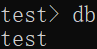
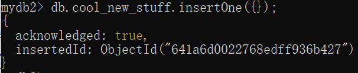
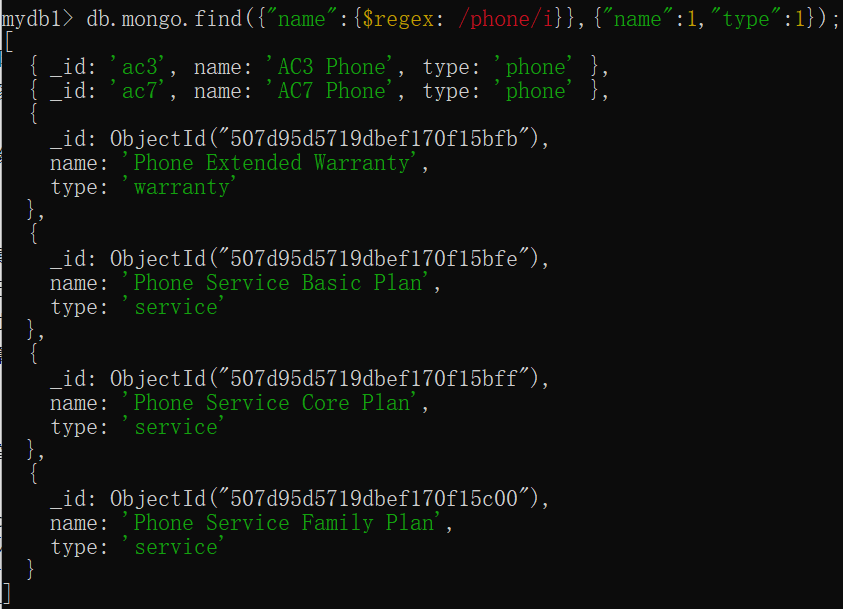

# 一.安装

在Windows环境下：
```
1、运行 Win + R
2、输入 services.msc 命令便可以查看到 MongoDB Server (MongoDB) 
3、mongosh表示启动MongoDB数据库
```

```
mongod -version
// 该命令会显示MongoDB数据库的相关信息，如果能显示信息，就表示已安装成功了！！！
```

# 二.MongoDB数据库中的常用述语:
1. 在MongoDB中，数据库是以文件形式存储的，数据库目录中存储了相应的数据库！
2. 在MongoDB中，把传统数据库中的 "表" 叫作：Collections "集合"！
3. 在MongoDB中，向集合存储数据时，直接以JSON格式，进行存取操作！
4. 在MongoDB中，集合中的数据叫作：Documents "文档"！

# 三.创建数据

## 1.查看所有数据库

```bash
show dbs
```
  

## 2.获取当前数据库名称

```bash
db
```
  

## 3.创建数据库mydab2,并插入一条doc数据

* document类似于关系型数据库中的行
```bash
test> db
test
test> use mydb2
switched to db mydb2
mydb2> db
mydb2
mydb2> doc={"title":"A","desc":"One"};
{ title: 'A', desc: 'One' }
mydb2> db.some.insertOne(doc);
{
  acknowledged: true,
  insertedId: ObjectId("641a6b4522768edff936b426")
}
```


* collection类似于关系型数据库中的表，字段类似于关系型数据库中的列。
```bash
db.cool_new_stuff.insertOne({});//创建一个collection
```
  

```bash
db.cool.new.stuff.insertOne({});
```
  

* 查看所有的collection
```
mydb2> show collections
cool_new_stuff
cool.new.stuff
some
```

# 四.查找

## 1.清屏

```bash
cls
```

## 2.查看数据
* 查找某个collection中的所有数据
```bash
mydb1> db
mydb1
mydb1> show collections
mongo
mydb1> db.mongo.find();
[
  {
    _id: 'ac3',
    name: 'AC3 Phone',
    brand: 'ACME',
    type: 'phone',
    price: 200,
    rating: 3.8,
    warranty_years: 1,
    available: true
  },
  {
    _id: 'ac7',
    name: 'AC7 Phone',
    brand: 'ACME',
    type: 'phone',
    price: 320,
    rating: 4,
    warranty_years: 1,
    available: false
  },
...
```

* db.mongo.find({"type":"service"})
  

* 只显示单一字段type
```bash
db.mongo.find({},{"type":1});
```
  

```bash
db.mongo.find({"type":"service"},{"type":1});
```
  

* 正则
```bash
db.mongo.find({"name":{$regex: /phone/i}},{"name":1,"type":1});//查找name中包含phone的数据，i表示不区分大小写
```
  

# 五.Query
## 1.limit与count
* limit返回数组
```bash
db.mongo.find({"name":{$regex: /phone/i}}).limit(2);
```
  

* count返回数字
```bash
db.mongo.find({"name":{$regex: /phone/i}}).count();
```
  

## 2.sort与skip
* sort排序
  * 顺序排序sort({"some":1})
  * 逆序排序sort({"some":-1})

```bash
db.mongo.find({},{"name":1,"type":1}).sort({"name":1});
```
  

* skip跳过几个数据
```bash
db.mongo.find({},{"name":1,"type":1}).sort({"name":1}).skip(2);
```
  

## 3.$gt与$lt
* $gt大于
db.mongo.find({"price":{$gt:29}},{"name":1,"type":1});
```
  
```

## 4.$in、$or、$and、$all
* $or
```bash
db.mongo.find({$or:[{"price":{$lt:30}},{"rating":{$gt:3}}]},{"price":1,"rating":1});
```
  

* $and
```bash
db.mongo.find({$and:[{"price":{$lt:30}},{"rating":{$gt:3}}]},{"price":1,"rating":1});
```
  

# 六.修改数据
## 1.字段操作 $set、$unset、$inc

updateOne()修改一条数据

* $set修改数据
```bash
db.mongo.updateOne({"name":"AC3 Case Red"},{$set:{"price":11}});
```
  

查询修改结果是否正确
  

* $unset删除数据
```bash
db.mongo.updateOne({"name":"AC3 Case Red"},{$unset:{"color":1}});
```
  

查询修改结果是否正确
  

* $inc增加数据
```bash
db.mongo.updateOne({"name":"AC3 Case Red"},{$inc:{"price":10}});
```
  

查询修改结果是否正确
  

## 2.数组操作 $push、$pull
* $push添加数据
```bash
db.mongo.updateOne({"name":"AC3 Case Red"},{$push:{"type":"new_type"}});
```
  

查询修改结果是否正确
  

* $pull删除数据
将上述$pull的部分改为$push，即可删除数据

## 3.delete
* deleteOne()删除一条数据
```bash
db.mongo.delete({"_id":"ac7"});
```
  

# 七.mongoDB与nodejs的结合
## 1.新建项目
```bash
mkdir mongo_pro1
```
  
## 2.切换到项目目录
```bash
cd mongo_pro1
```
## 3.初始化项目
```bash
npm init -y
```
## 4.打开vscode
```bash
code .
```
## 5.安装依赖
```bash
npm i mongodb
```
